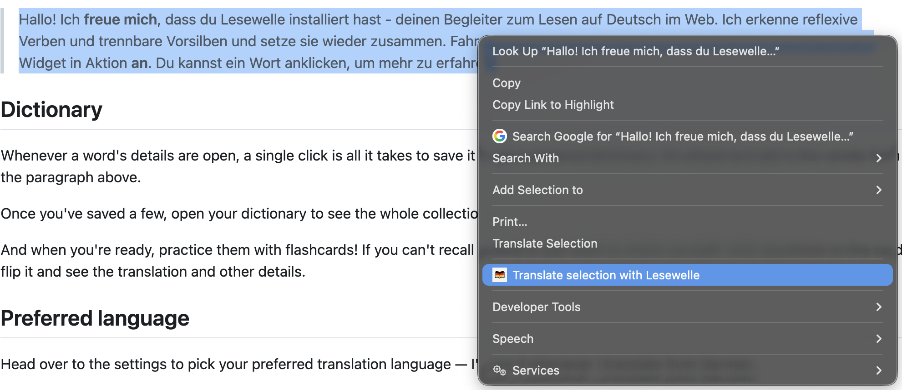
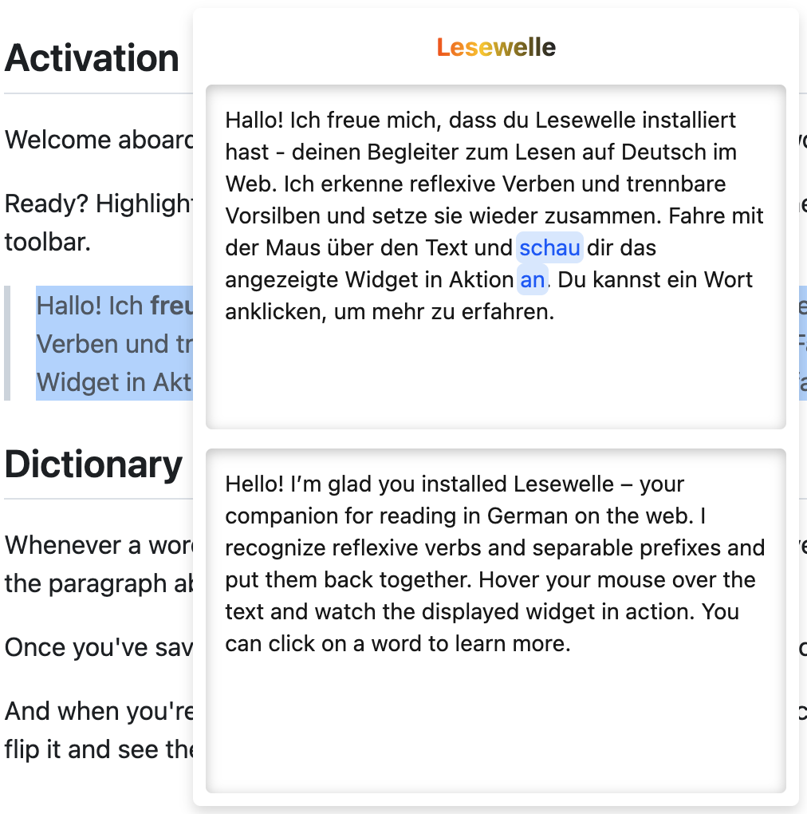
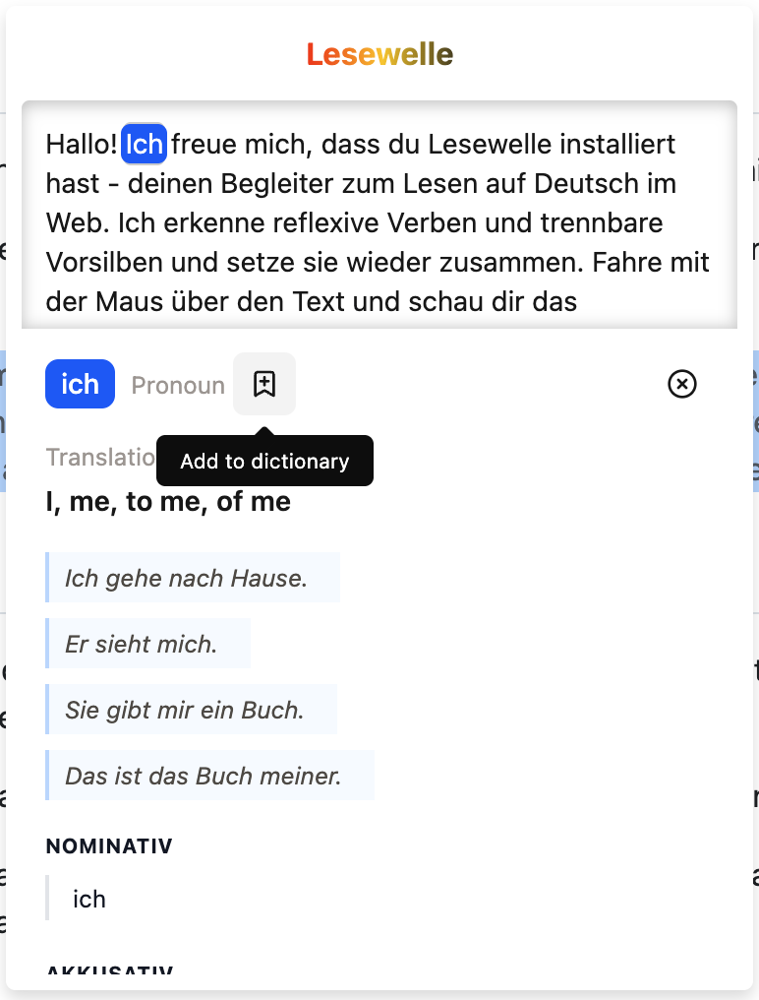
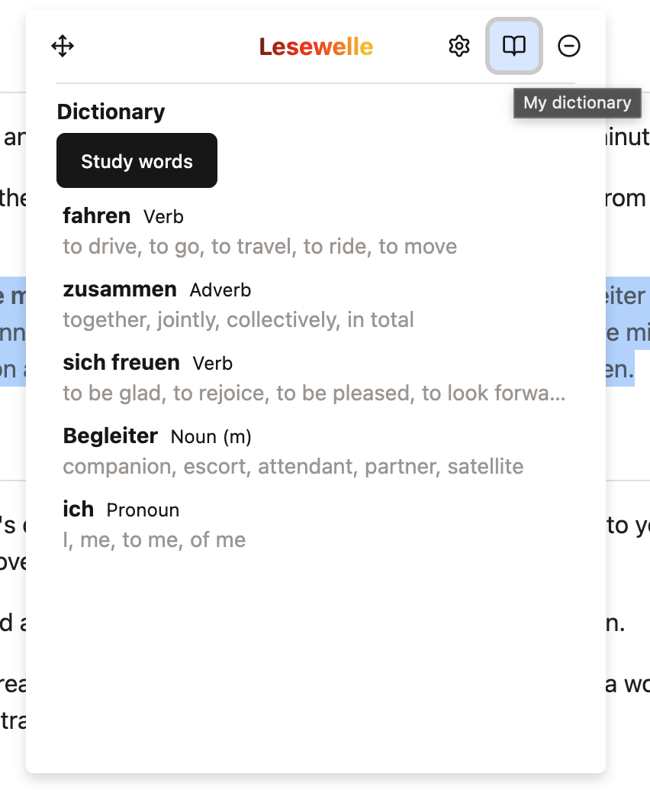
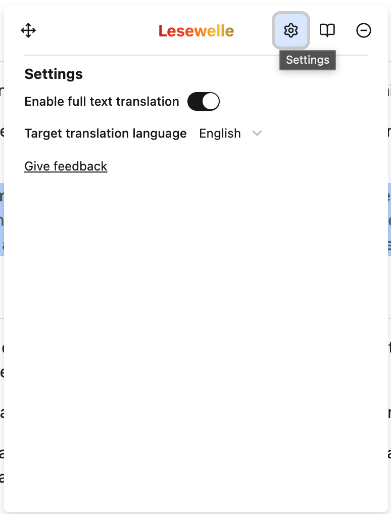

# Onboarding

## Activation

Welcome aboard, and thanks for giving Lesewelle a try! In the next two minutes you'll see everything this little reading buddy can do.

Ready? Highlight the German paragraph below, then wake me up either from the right-click menu or by tapping my icon up in your browser toolbar.

 

> Hallo! Ich **freue mich**, dass du Lesewelle installiert hast - deinen Begleiter zum Lesen auf Deutsch im Web. Ich erkenne reflexive Verben und trennbare Vorsilben und setze sie wieder zusammen. Fahre mit der Maus über den Text und **schau** dir das angezeigte Widget in Aktion **an**. Du kannst ein Wort anklicken, um mehr zu erfahren.

 

## Dictionary

Whenever a word's details are open, a single click is all it takes to save it to your personal dictionary. Go ahead and add a few words from the paragraph above.

Once you've saved a few, open your dictionary to see the whole collection. And when you're ready, practice them with flashcards! If you can't recall a word or just want to check yourself, click anywhere on the card to flip it and see the translation and other details.

## Preferred language

Head over to the settings to pick your preferred translation language — I'll use it whenever I translate from German.

